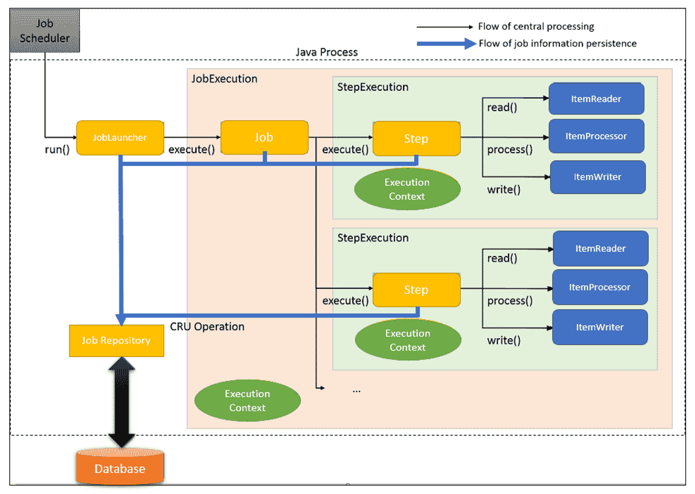

# spring-batch-v5

## Core component
### Job Repository
    - Lưu trữ thông tin về job, step, job instance, job execution, step execution
    - Lưu trữ thông tin về trạng thái của job, step
### Step
    - Là một bước hoặc một giai đoạn trong quá trình xử lý batch
    - Nếu các step được thực hiện tuần tự thì gọi là `chunk-oriented processing`
    - Chunk: được sử dụng để xử lý các logic phức tạp với các giai đoạn:
        + `ItemReader`: Đọc dữ liệu từ nguồn dữ liệu
        + `ItemProcessor`: Xử lý dữ liệu
        + `ItemWriter`: Ghi dữ liệu ra nguồn dữ liệu
    - Để xây dựng 1 Step với chunk phải cần xác định chunk length và các thành phần của chunk. Nó cho biết cần bao nhiêu mục để thực hiện giao dịch trong cơ sở dữ liệu và rất cần thiết để xác định hiệu suất công việc và khởi động lại batch.
    - Các step có thể được thực hiện tuần tự hoặc song song
    - Có thể thực thi các Step đơn giản với Tasklet
        + CallableTaskletAdapter: Sử dụng tính năng này để tạo 1 Tasklet thực thi một luồng riêng biệt nhưng không tham số hóa việc thực hiện Step
        + MethodInvokingTaskletAdapter: Việc triển khai này rất hữu ích khi cho phép gọi một logic hiện có thay vì khai báo một tasklet chỉ để gói gọn nó
        + SystemCommandTasklet: Sử dụng tính năng này để thực hiện một lệnh hệ thống

| Tính năng           | Step                                 | Chunk                                                                                                                                             | Tasklet                            |
|---------------------|--------------------------------------|---------------------------------------------------------------------------------------------------------------------------------------------------|------------------------------------|
| Khi nào sử dụng     | Đối với các giai đoạn độc lập của công việc xử lý hàng loạt | Khi công việc phức tạp và yêu cầu thực hiện nhiều nhiệm vụ như đọc, xử lý và ghi dữ liệu                                                          | Khi công việc cần được thực hiện như một nhiệm vụ đơn lẻ   |
| Cách thức hoạt động | Một giai đoạn độc lập và tuần tự trong quá trình xử lý hàng loạt | Đọc dữ liệu đầu vào, xử lý theo logic nghiệp vụ, tổng hợp đến khi đạt được khoảng thời gian cam kết và gửi khối dữ liệu ra file hoặc bảng dữ liệu | Không có tổng hợp; chỉ thực hiện nhiệm vụ được giao         |
| Usage               | Để kiểm soát các thao tác xử lý hàng loạt | Thường xuyên sử dụng để thực hiện Step                                                                                                            | Ít khi được sử dụng                   |
| Usecase             |                                      | Thường được sử dụng trong các trường hợp có nhiều Step được tổng hợp lại, như sao chép dữ liệu, xử lý và chuyển dữ liệu                           | Thường được sử dụng trong các nhiệm vụ đơn lẻ, như loại bỏ một nguồn lực hoặc thực hiện một truy vấn |

### Job Launcher
    - Là một interface dùng để khởi chạy job
    - Thực hiện việc khởi chạy job
    - Xem xét các yếu tố như: 
        + JobInstance: Một phiên bản của job
        + JobParameters: Tham số của job
        + JobExecution: Kết quả của job

## Batch processing architecture

**Luồng xử lý chính:**
- `JobLauncher` được khởi tạo từ trình lập lịch công việc (job scheduler).
- `JobLauncher` thực hiện công việc (job).
- Công việc (job) thực hiện bước (step).
- Bước (step) sử dụng `ItemReader` để lấy dữ liệu đầu vào.
- `ItemProcessor` được sử dụng để xử lý dữ liệu đầu vào trong bước (step).
- `ItemWriter` được sử dụng bởi bước (step) để xuất dữ liệu đã xử lý.

**Luồng để lưu trữ thông tin công việc:**
- `JobLauncher` đăng ký `JobInstance` trong Database thông qua `JobRepository`.
- `JobLauncher` đăng ký việc thực hiện công việc (job execution) đã bắt đầu trong Database qua `JobRepository`.
- `JobStep` cập nhật các chi tiết khác nhau như số lượng bản ghi I/O và trạng thái trong Database qua `JobRepository`.
- `JobLauncher` đăng ký rằng việc thực hiện công việc (job execution) đã hoàn thành thành công trong Database thông qua `JobRepository`.

## Problem
- Lấy dữ liệu từ nguồn khác hàng (client), phân loại và tạo tài khoản ngân hàng cho khách dựa trên mức lương.
- Dữ liệu đầu vào: table client sql
- Dữ liệu đầu ra: table bank_account sql, file tài khoản ngân hàng dạng txt, file những khách hàng không đúng định dạng
